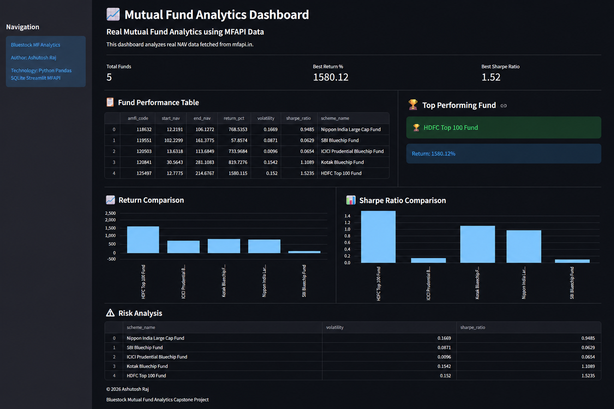

# Mutual Fund Analytics Capstone Project

## Overview

## Dashboard Preview

### Live Dashboard Features

- Fund Performance Analysis
- Return Comparison
- Sharpe Ratio Analysis
- Risk Analysis
- Real MFAPI Data Integration

## Features

- Real Mutual Fund NAV Data Integration
- Data Cleaning and Processing
- SQLite Database Storage
- SQL Analytics
- Fund Performance Analysis
- Risk Analysis
- Sharpe Ratio Calculation
- Interactive Streamlit Dashboard
- Performance Visualization

## Technology Stack

- Python
- Pandas
- SQLite
- Streamlit
- Matplotlib
- MFAPI

## Project Structure

## How To Run

### Install Dependencies

pip install -r requirements.txt

### Run Dashboard

streamlit run dashboard/app.py

## Author

Ashutosh Raj